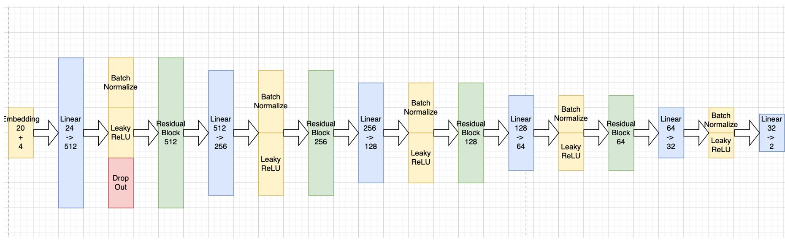

# AI-content-detector

There are 2 different parts of this project: `code detector` and `general text detector`

## General Methodology
We all know that `perplexity` can measure if a text is close to LLM generated text (with loss).

Perplexity (PPL) can be calculated by the following formulas:
``` math
Cross Entropy = -\frac{1}{N}\sum_{i=1}^Nlogp(x_n|x_1,x_2,...,x_{i-1})
```
``` math
PPL = exp(Cross Entropy)
```
If we know the very detailed information of a LLM `M`, we can use $$ PPL < threshold (M)$$ as a condition to predict the assumption with confidence.

However, since it's no way to know the exact detail of a model (e.g. GPT-4o), even we don't know which model is the source of given text, calculating PPL directly is not feasible.

To address this issue, I propose we can use many of the same architecture models to approximate the distribution of PPL. By calculating the PPL vector and letting a DNN learn from the PPL vectors, the DNN model will learn the capability to predict the source of given text.

The whole steps are shown as follows:

1. Collect the training dataset: 25% OpenAI + 25% DeepSeek + 50% human text
2. Use 20 different small size or moderate size LLM, to calculate the PPL
3. Then we will have `10000 * 1 * 20` tensor as input.
4. Train a new deep neural network on the tensor.
5. validate the result on another `2000 * 1 * 20`.


## Code Detector

### Data Collection
Total Dataset Size is `12000`. Among them, `6000` is human written codes extracted from Hugging Face dataset: `code_search_net`. I extracted 4 programming languages: Python, Java, Go, JavaScript with 1500 each.

The rest `6000` data is generated by `OpenAI (GPT-4o, GPT-4o-mini)` and `DeepSeek (DeepSeek V3)` via APIs. All of them are use random selected prompt from 166 prepared prompts pool. These prompts are also generated by LLMs (mainly GPT-4o and DeepSeek R1). The prompts used to generate codes are shown as follows:

``` Python
"Write a Python function to calculate factorial",
"Implement a REST API in JavaScript using Express.js that handles user login",
"Implement a Python function to reverse a linked list in O(n) time:",
"Write a Java method to find the longest palindromic substring in a given string:",
"Create a Rust function to calculate the nth Fibonacci number using memoization:",
"Design a Python algorithm to solve the traveling salesman problem with a greedy approach:",
"Write a JavaScript function to merge two sorted arrays into a single sorted array:",
"Implement a Go program to perform matrix exponentiation efficiently:",
"Create a Kotlin function to detect cycles in a directed graph using DFS:",
"Write a TypeScript function to shuffle an array in-place using Fisher-Yates algorithm:",
"Build a React component in JavaScript that displays a real-time chat interface:",
"Create a Django view in Python to handle user registration with email verification:",
"Write a Node.js/Express middleware to authenticate users using JWT tokens:",
"Design a Flask API endpoint in Python to upload and resize images asynchronously:",
"Implement a Vue.js frontend component to visualize stock market data with charts:",
"Create a Spring Boot controller in Java to manage a RESTful inventory system:",
"Write an Angular service in TypeScript to fetch paginated data from a REST API:",
"Build a WebSocket server in Go to broadcast messages to multiple clients:",
"Design a FastAPI endpoint in Python with rate limiting and API key authentication:",
"Implement a Next.js page that renders server-side data from a PostgreSQL database:",
"Write a Python script using Pandas to clean CSV data by removing null values:",
"Create a SQL query to find the top 5 customers by total purchase amount:",
"Design a MongoDB aggregation pipeline to calculate monthly sales trends:",
"Implement a Rust program to parse JSON files and convert them to Avro format:",
"Write a Java method using Hibernate to batch-insert 10,000 records efficiently:",
"Create a Kafka consumer in Scala to process real-time event streams:",
"Build a Python ETL pipeline with Airflow to load data into Redshift:",
"Design a GraphQL schema in TypeScript for querying a social media network:",
"Write a C# LINQ query to filter products by price range and category:",
"Implement a Go TCP server that handles multiple concurrent client connections:",
"Write a Python script to monitor CPU usage and log anomalies to a file:",
"Create a C++ program to encrypt files using AES-256 in CBC mode:",
"Design a Bash script to automate backup of directories to AWS S3:",
"Write a Java NIO server that handles non-blocking socket operations:",
"Build a PowerShell script to audit Windows event logs for security events:",
"Create a Python decorator to measure function execution time with nanosecond precision:",
"Implement a Kubernetes operator in Go to manage custom resources:",
"Design an Ansible playbook to deploy a web app across 100+ servers:",
"Write a PyTorch model in Python for image classification on CIFAR-10:",
"Create a TensorFlow Keras pipeline to preprocess text data for NLP tasks:",
"Implement a reinforcement learning agent in Python using OpenAI Gym:",
"Design a Scikit-learn pipeline to handle missing data and feature scaling:",
"Write a Jupyter notebook to visualize MNIST digit embeddings with t-SNE:",
"Create a Hugging Face transformer pipeline for text summarization:",
"Implement a GAN model in PyTorch to generate synthetic face images:",
"Write a Spark MLlib script to cluster large-scale customer data:",
"Write pytest cases in Python to validate an API response schema:",
"Create a JUnit test suite in Java for edge cases in a sorting algorithm:",
"Design a Selenium script in Python to automate login flow testing:",
"Implement a Go benchmark to compare two JSON parsing libraries:",
"Write a TypeScript Cypress test to verify e-commerce checkout functionality:",
"Create a load testing script in Locust (Python) for a REST API:",
"Design a Mockito test in Java to verify database transaction rollbacks:",
"Write a debug script in C++ to detect memory leaks using Valgrind:",
"Implement a Python decorator to log exceptions with stack traces:",
"Create a chaos engineering experiment script for Kubernetes pods:",
"Implement a Python function to validate email addresses using regex:",
"Write a Java method to convert a decimal number to binary without using built-in functions:",
"Create a C program to list all files in a directory recursively:",
"Design a JavaScript class to represent a 2D vector with addition and magnitude methods:",
"Build a Rust function to calculate the Levenshtein distance between two strings:",
"Write a Go program to generate a random password with specified length and character sets:",
"Create a TypeScript interface for a geometric shape with area calculation method:",
"Implement a Kotlin extension function to reverse words in a string while preserving whitespace:",
"Write a Swift struct to model polynomial equations with evaluation method:",
"Design a Dart function to format timestamps into human-readable relative time (e.g. '3 hours ago'):",
"Create a Python CLI tool to monitor network bandwidth usage per process:",
"Implement a Bash script to find and archive log files older than 30 days:",
"Write a PowerShell module to manage Windows service dependencies:",
"Design a C++ Linux daemon to watch directory changes and trigger actions:",
"Build a Rust command-line JSON parser with jq-like query syntax:",
"Create a Java utility to batch resize images while preserving EXIF data:",
"Implement a Go program to simulate TCP packet loss for network testing:",
"Write a Python context manager to temporarily modify environment variables:",
"Design a C# Windows service to monitor USB device connections:",
"Create a Ruby gem to generate SSH config files from YAML templates:",
"Implement a Python script using Matplotlib to create animated sorting algorithm visualizations:",
"Write a JavaScript/D3.js visualization showing real-time cryptocurrency price movements:",
"Create a R Shiny dashboard to explore COVID-19 vaccination rates by country:",
"Design a Plotly Express Python notebook to visualize 3D molecular structures:",
"Build a JavaFX application to display interactive fractal patterns:",
"Write a TypeScript React component to render hierarchical tree diagrams:",
"Implement a SwiftUI view showing live heart rate data from HealthKit:",
"Create a Kotlin Android app to plot sensor data in real-time line charts:",
"Design a Julia script to generate Voronoi diagrams from random points:",
"Write a Processing (Java) sketch to visualize audio frequency spectrum:",
"Create a Python Flask API to serve a pre-trained image classification model:",
"Implement a TensorFlow Lite Android app for real-time object detection:",
"Write a Rust WebAssembly module to run ONNX models in the browser:",
"Design a Kubernetes manifest to scale PyTorch inference pods based on queue depth:",
"Build a C++ OpenCV pipeline to preprocess video frames for model input:",
"Create a FastAPI endpoint with JWT authentication for model prediction:",
"Implement a Python script to convert Keras models to CoreML format:",
"Write a Terraform configuration to deploy ML models on AWS SageMaker:",
"Design a Dart Flutter plugin to access device-native ML accelerators:",
"Build a Go service to batch process predictions using GPU workers:",
"Write a MicroPython script for ESP32 to read temperature sensor via I2C:",
"Implement an Arduino C++ program to control servo motors via Bluetooth:",
"Create a Raspberry Pi Python daemon to monitor GPIO interrupts:",
"Design a Rust embedded-hal driver for STM32-based IMU data collection:",
"Build a LabVIEW VI to interface with oscilloscope via SCPI commands:",
"Write a Verilog module for FPGA-based PWM signal generation:",
"Implement a Zig program to manage low-power sleep modes on nRF52:",
"Create a PlatformIO configuration for cross-compiling to multiple MCUs:",
"Design a FreeRTOS task scheduler for robotic arm control:",
"Build a CircuitPython library to parse NMEA GPS data:",
"Implement a Python Pygame controller for a 2D platformer character with double jump:",
"Create a C# Unity script to procedurally generate maze levels:",
"Write a JavaScript Phaser.io game loop for a space shooter with particle effects:",
"Design a Rust Bevy ECS system for RTS-style unit selection:",
"Build a Lua script for Roblox to create destructible terrain:",
"Implement a Java LibGDX component for isometric tilemap rendering:",
"Create a Godot GDScript shader for water surface refraction effects:",
"Write a C++ Unreal Engine blueprint for dynamic weather system transitions:",
"Design a Swift SpriteKit action sequence for puzzle piece animations:",
"Build a Python text-based RPG combat system with elemental weaknesses:",
"Write a Python function to generate a UUID v4 with hyphens removed:",
"Implement a Java method to convert Markdown text to plain text without HTML tags:",
"Create a C# extension method to truncate strings to max length with ellipsis:",
"Design a JavaScript utility to deep clone objects handling circular references:",
"Build a Rust function to validate ISBN-13 numbers with checksum verification:",
"Write a Go program to extract EXIF metadata from JPEG files:",
"Implement a TypeScript type guard to check if a value is a valid RGB tuple:",
"Create a Kotlin coroutine to retry HTTP requests with exponential backoff:",
"Design a Swift playground snippet to animate UIView rotation with CABasicAnimation:",
"Write a Dart function to format numbers as compact strings (e.g. 1.2K):",
"Implement a Python context manager to atomically write files with .tmp suffix:",
"Create a Java utility to merge multiple PDF documents using Apache PDFBox:",
"Write a C++ program to parse INI files with section inheritance:",
"Design a Node.js stream pipeline to convert CSV to NDJSON:",
"Build a Rust library to read/write ZIP archives with password protection:",
"Implement a PowerShell script to bulk rename files with regex pattern matching:",
"Create a Bash script to compare directories and sync changes via rsync:",
"Write a Python generator to yield large XML files element-by-element:",
"Design a Go CLI tool to convert between YAML, TOML and JSON formats:",
"Implement a C# Windows service to monitor file system changes in real-time:",
"Implement a Python asyncio TCP proxy server with connection pooling:",
"Create a Java CompletableFuture chain to execute async tasks with fallbacks:",
"Design a C++ thread pool using std::async with work stealing:",
"Write a Go program to fan-out/fan-in processing of Kafka messages:",
"Build a Rust Tokio service to rate limit HTTP requests per IP:",
"Implement a C# Parallel.ForEach with cancellation token support:",
"Create a Kotlin flow pipeline to batch process sensor data streams:",
"Design a JavaScript Web Worker pool for CPU-intensive image processing:",
"Write a Ruby Fiber-based scheduler for lightweight concurrency:",
"Implement a Erlang/Elixir GenServer for distributed state management:",
"Write a Python function to securely compare HMAC digests in constant time:",
"Implement a Java KeyStore wrapper to manage X.509 certificates:",
"Design a C OpenSSL wrapper to perform AES-GCM encryption/decryption:",
"Create a Node.js middleware to sanitize user input against XSS attacks:",
"Build a Rust implementation of OAuth2 client credentials flow:",
"Implement a Go program to generate secure random passwords with entropy checks:",
"Write a PowerShell script to audit Windows registry for weak permissions:",
"Design a C# ASP.NET Core attribute to validate JWT claims:",
"Create a Bash script to verify PGP signatures on downloaded artifacts:",
"Implement a Swift function to securely store keys in iOS Keychain:",
"Implement a Python decorator to capture and log exceptions with traceback:",
"Create a Java AOP aspect to wrap methods with circuit breaker pattern:",
"Design a C++ RAII class to handle database connection exception safety:",
"Write a Go middleware to recover from panics in HTTP handlers:",
"Build a Rust macro to generate error types with thiserror-like derive:",
"Implement a TypeScript decorator to retry failed async class methods:",
"Create a Kotlin sealed class hierarchy for domain-specific error types:",
"Design a C# Polly policy to handle transient faults in microservices:",
"Write a Bash script to parse Apache logs and detect 5xx error spikes:",
"Implement a Ruby module to centralize error reporting to Sentry:",        "Write a Python function to calculate factorial",
"Implement a REST API in JavaScript using Express.js that handles user login",
"Implement a Python function to reverse a linked list in O(n) time:",
"Write a Java method to find the longest palindromic substring in a given string:",
"Create a Rust function to calculate the nth Fibonacci number using memoization:",
"Design a Python algorithm to solve the traveling salesman problem with a greedy approach:",
"Write a JavaScript function to merge two sorted arrays into a single sorted array:",
"Implement a Go program to perform matrix exponentiation efficiently:",
"Create a Kotlin function to detect cycles in a directed graph using DFS:",
"Write a TypeScript function to shuffle an array in-place using Fisher-Yates algorithm:",
"Build a React component in JavaScript that displays a real-time chat interface:",
"Create a Django view in Python to handle user registration with email verification:",
"Write a Node.js/Express middleware to authenticate users using JWT tokens:",
"Design a Flask API endpoint in Python to upload and resize images asynchronously:",
"Implement a Vue.js frontend component to visualize stock market data with charts:",
"Create a Spring Boot controller in Java to manage a RESTful inventory system:",
"Write an Angular service in TypeScript to fetch paginated data from a REST API:",
"Build a WebSocket server in Go to broadcast messages to multiple clients:",
"Design a FastAPI endpoint in Python with rate limiting and API key authentication:",
"Implement a Next.js page that renders server-side data from a PostgreSQL database:",
"Write a Python script using Pandas to clean CSV data by removing null values:",
"Create a SQL query to find the top 5 customers by total purchase amount:",
"Design a MongoDB aggregation pipeline to calculate monthly sales trends:",
"Implement a Rust program to parse JSON files and convert them to Avro format:",
"Write a Java method using Hibernate to batch-insert 10,000 records efficiently:",
"Create a Kafka consumer in Scala to process real-time event streams:",
"Build a Python ETL pipeline with Airflow to load data into Redshift:",
"Design a GraphQL schema in TypeScript for querying a social media network:",
"Write a C# LINQ query to filter products by price range and category:",
"Implement a Go TCP server that handles multiple concurrent client connections:",
"Write a Python script to monitor CPU usage and log anomalies to a file:",
"Create a C++ program to encrypt files using AES-256 in CBC mode:",
"Design a Bash script to automate backup of directories to AWS S3:",
"Write a Java NIO server that handles non-blocking socket operations:",
"Build a PowerShell script to audit Windows event logs for security events:",
"Create a Python decorator to measure function execution time with nanosecond precision:",
"Implement a Kubernetes operator in Go to manage custom resources:",
"Design an Ansible playbook to deploy a web app across 100+ servers:",
"Write a PyTorch model in Python for image classification on CIFAR-10:",
"Create a TensorFlow Keras pipeline to preprocess text data for NLP tasks:",
"Implement a reinforcement learning agent in Python using OpenAI Gym:",
"Design a Scikit-learn pipeline to handle missing data and feature scaling:",
"Write a Jupyter notebook to visualize MNIST digit embeddings with t-SNE:",
"Create a Hugging Face transformer pipeline for text summarization:",
"Implement a GAN model in PyTorch to generate synthetic face images:",
"Write a Spark MLlib script to cluster large-scale customer data:",
"Write pytest cases in Python to validate an API response schema:",
"Create a JUnit test suite in Java for edge cases in a sorting algorithm:",
"Design a Selenium script in Python to automate login flow testing:",
"Implement a Go benchmark to compare two JSON parsing libraries:",
"Write a TypeScript Cypress test to verify e-commerce checkout functionality:",
"Create a load testing script in Locust (Python) for a REST API:",
"Design a Mockito test in Java to verify database transaction rollbacks:",
"Write a debug script in C++ to detect memory leaks using Valgrind:",
"Implement a Python decorator to log exceptions with stack traces:",
"Create a chaos engineering experiment script for Kubernetes pods:",
"Implement a Python function to validate email addresses using regex:",
"Write a Java method to convert a decimal number to binary without using built-in functions:",
"Create a C program to list all files in a directory recursively:",
"Design a JavaScript class to represent a 2D vector with addition and magnitude methods:",
"Build a Rust function to calculate the Levenshtein distance between two strings:",
"Write a Go program to generate a random password with specified length and character sets:",
"Create a TypeScript interface for a geometric shape with area calculation method:",
"Implement a Kotlin extension function to reverse words in a string while preserving whitespace:",
"Write a Swift struct to model polynomial equations with evaluation method:",
"Design a Dart function to format timestamps into human-readable relative time (e.g. '3 hours ago'):",
"Create a Python CLI tool to monitor network bandwidth usage per process:",
"Implement a Bash script to find and archive log files older than 30 days:",
"Write a PowerShell module to manage Windows service dependencies:",
"Design a C++ Linux daemon to watch directory changes and trigger actions:",
"Build a Rust command-line JSON parser with jq-like query syntax:",
"Create a Java utility to batch resize images while preserving EXIF data:",
"Implement a Go program to simulate TCP packet loss for network testing:",
"Write a Python context manager to temporarily modify environment variables:",
"Design a C# Windows service to monitor USB device connections:",
"Create a Ruby gem to generate SSH config files from YAML templates:",
"Implement a Python script using Matplotlib to create animated sorting algorithm visualizations:",
"Write a JavaScript/D3.js visualization showing real-time cryptocurrency price movements:",
"Create a R Shiny dashboard to explore COVID-19 vaccination rates by country:",
"Design a Plotly Express Python notebook to visualize 3D molecular structures:",
"Build a JavaFX application to display interactive fractal patterns:",
"Write a TypeScript React component to render hierarchical tree diagrams:",
"Implement a SwiftUI view showing live heart rate data from HealthKit:",
"Create a Kotlin Android app to plot sensor data in real-time line charts:",
"Design a Julia script to generate Voronoi diagrams from random points:",
"Write a Processing (Java) sketch to visualize audio frequency spectrum:",
"Create a Python Flask API to serve a pre-trained image classification model:",
"Implement a TensorFlow Lite Android app for real-time object detection:",
"Write a Rust WebAssembly module to run ONNX models in the browser:",
"Design a Kubernetes manifest to scale PyTorch inference pods based on queue depth:",
"Build a C++ OpenCV pipeline to preprocess video frames for model input:",
"Create a FastAPI endpoint with JWT authentication for model prediction:",
"Implement a Python script to convert Keras models to CoreML format:",
"Write a Terraform configuration to deploy ML models on AWS SageMaker:",
"Design a Dart Flutter plugin to access device-native ML accelerators:",
"Build a Go service to batch process predictions using GPU workers:",
"Write a MicroPython script for ESP32 to read temperature sensor via I2C:",
"Implement an Arduino C++ program to control servo motors via Bluetooth:",
"Create a Raspberry Pi Python daemon to monitor GPIO interrupts:",
"Design a Rust embedded-hal driver for STM32-based IMU data collection:",
"Build a LabVIEW VI to interface with oscilloscope via SCPI commands:",
"Write a Verilog module for FPGA-based PWM signal generation:",
"Implement a Zig program to manage low-power sleep modes on nRF52:",
"Create a PlatformIO configuration for cross-compiling to multiple MCUs:",
"Design a FreeRTOS task scheduler for robotic arm control:",
"Build a CircuitPython library to parse NMEA GPS data:",
"Implement a Python Pygame controller for a 2D platformer character with double jump:",
"Create a C# Unity script to procedurally generate maze levels:",
"Write a JavaScript Phaser.io game loop for a space shooter with particle effects:",
"Design a Rust Bevy ECS system for RTS-style unit selection:",
"Build a Lua script for Roblox to create destructible terrain:",
"Implement a Java LibGDX component for isometric tilemap rendering:",
"Create a Godot GDScript shader for water surface refraction effects:",
"Write a C++ Unreal Engine blueprint for dynamic weather system transitions:",
"Design a Swift SpriteKit action sequence for puzzle piece animations:",
"Build a Python text-based RPG combat system with elemental weaknesses:",
"Write a Python function to generate a UUID v4 with hyphens removed:",
"Implement a Java method to convert Markdown text to plain text without HTML tags:",
"Create a C# extension method to truncate strings to max length with ellipsis:",
"Design a JavaScript utility to deep clone objects handling circular references:",
"Build a Rust function to validate ISBN-13 numbers with checksum verification:",
"Write a Go program to extract EXIF metadata from JPEG files:",
"Implement a TypeScript type guard to check if a value is a valid RGB tuple:",
"Create a Kotlin coroutine to retry HTTP requests with exponential backoff:",
"Design a Swift playground snippet to animate UIView rotation with CABasicAnimation:",
"Write a Dart function to format numbers as compact strings (e.g. 1.2K):",
"Implement a Python context manager to atomically write files with .tmp suffix:",
"Create a Java utility to merge multiple PDF documents using Apache PDFBox:",
"Write a C++ program to parse INI files with section inheritance:",
"Design a Node.js stream pipeline to convert CSV to NDJSON:",
"Build a Rust library to read/write ZIP archives with password protection:",
"Implement a PowerShell script to bulk rename files with regex pattern matching:",
"Create a Bash script to compare directories and sync changes via rsync:",
"Write a Python generator to yield large XML files element-by-element:",
"Design a Go CLI tool to convert between YAML, TOML and JSON formats:",
"Implement a C# Windows service to monitor file system changes in real-time:",
"Implement a Python asyncio TCP proxy server with connection pooling:",
"Create a Java CompletableFuture chain to execute async tasks with fallbacks:",
"Design a C++ thread pool using std::async with work stealing:",
"Write a Go program to fan-out/fan-in processing of Kafka messages:",
"Build a Rust Tokio service to rate limit HTTP requests per IP:",
"Implement a C# Parallel.ForEach with cancellation token support:",
"Create a Kotlin flow pipeline to batch process sensor data streams:",
"Design a JavaScript Web Worker pool for CPU-intensive image processing:",
"Write a Ruby Fiber-based scheduler for lightweight concurrency:",
"Implement a Erlang/Elixir GenServer for distributed state management:",
"Write a Python function to securely compare HMAC digests in constant time:",
"Implement a Java KeyStore wrapper to manage X.509 certificates:",
"Design a C OpenSSL wrapper to perform AES-GCM encryption/decryption:",
"Create a Node.js middleware to sanitize user input against XSS attacks:",
"Build a Rust implementation of OAuth2 client credentials flow:",
"Implement a Go program to generate secure random passwords with entropy checks:",
"Write a PowerShell script to audit Windows registry for weak permissions:",
"Design a C# ASP.NET Core attribute to validate JWT claims:",
"Create a Bash script to verify PGP signatures on downloaded artifacts:",
"Implement a Swift function to securely store keys in iOS Keychain:",
"Implement a Python decorator to capture and log exceptions with traceback:",
"Create a Java AOP aspect to wrap methods with circuit breaker pattern:",
"Design a C++ RAII class to handle database connection exception safety:",
"Write a Go middleware to recover from panics in HTTP handlers:",
"Build a Rust macro to generate error types with thiserror-like derive:",
"Implement a TypeScript decorator to retry failed async class methods:",
"Create a Kotlin sealed class hierarchy for domain-specific error types:",
"Design a C# Polly policy to handle transient faults in microservices:",
"Write a Bash script to parse Apache logs and detect 5xx error spikes:",
"Implement a Ruby module to centralize error reporting to Sentry:",
```

The random selected prompt will concat with the following text: `", if this question has been asked, try to use a different answer. Only response codes and comments, no other content: "` to ensure the model response unique and code-only content.

### Model Used
Most people used AI-generated content are generated from very large, commercial-used LLMs with decoder-only architectures. For example, ChatGPT (GPT-3.5, GPT-4o) and DeepSeek R1, Grok. If we want to approximate these models' PPL, we would like to use the same decoder-only architecture models. Moreover, to reduce the calculation time, the size of these models should be small. Although one small model cannot approximate the true model, but many of them still have high probability to represent the true model somehow.

Belows are the models I used.

| No.           | Model         | Size          | Type          |        
| ------------- | ------------- | ------------- | ------------- |
| 1             | gpt2          | 137M          | General       |
| 2             | gpt2-xl       | 1.61B         | General       |
| 3             | gpt2-medium   | 380M          | General       |
| 4             | EleutherAI/gpt-neo-125M       | 125M          | General       |
| 5             | EleutherAI/gpt-neo-1.3B       | 1.3B          | General       |
| 6             | EleutherAI/gpt-neo-2.7B       | 2.7B          | General       |
| 7             | Llama-3.2-1B  | 1B            | General       |
| 8             | Llama-3.2-3B-Instruct         | 3B            | General       |
| 9             | CodeLlama-7b-Instruct-hf      | 7B            | Code          |
| 10            | CodeLlama-13b-Instruct-hf     | 13B           | Code          |
| 11            | bigcode/starcoder2-3b         | 3B            | Code          |
| 12            | DeepSeek-Coder-V2-Lite-Base   | 15.7B         | Code          |
| 13            | deepseek-coder-1.3b-instruct  | 1.3B          | Code          |
| 14            | DeepSeek-V2-Lite-Chat         | 15.7B         | General       |
| 15            | Salesforce/codegen-350M-mono  | 350M          | Code          |
| 16            | Salesforce/codegen-2B-mono    | 2B            | Code          |
| 17            | Qwen2.5-0.5B-Instruct         | 500M          | General       |
| 18            | Qwen2.5-Coder-1.5B-Instruct   | 1.5B          | Code          |
| 19            | Phi-4-mini-instruct           | 3.84B         | General       |
| 20            | Phi-3.5-mini-instruct         | 3.82B         | General       |


### Deep Neural Network Design



### Validation Result
TODO